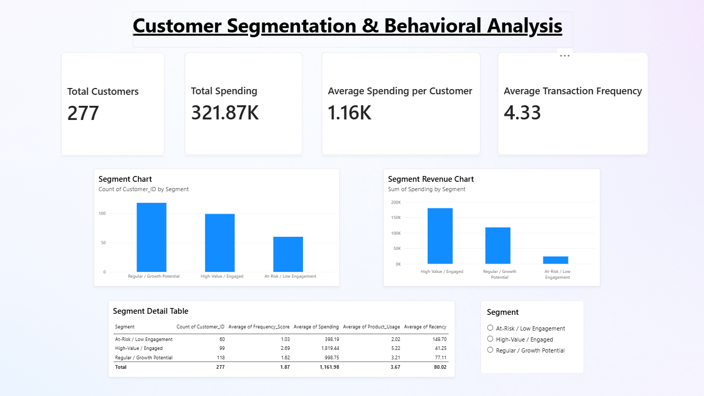

# Customer Segmentation & Behavioral Analysis

A customer analytics project focused on understanding purchasing behavior, engagement patterns, and customer segments using **Excel, Python, SQL, and Power BI**.

## Dashboard Preview

## Business Objective

The objective is to analyze customer transaction data, identify behavioral differences between customers, and create three explainable customer segments based on:

* Transaction Frequency
* Spending
* Recency
* Product Usage

The resulting segments are used to develop targeted business recommendations for customer retention, growth, and re-engagement.

## Dataset

The project uses a synthetic retail/e-commerce transaction dataset containing:

* 1,200 transactions
* 277 unique customers
* 12 products
* 5 product categories
* 4 regions
* 12 months of transaction data

### Columns

* `Customer_ID`
* `Transaction_ID`
* `Transaction_Date`
* `Product`
* `Product_Category`
* `Quantity`
* `Unit_Price`
* `Transaction_Amount`
* `Payment_Method`
* `Region`

## Project Workflow

Raw Transaction Data
        ↓
Excel Data Cleaning
        ↓
Python Exploratory Data Analysis
        ↓
Customer-Level Metrics
        ↓
Behavioral Segmentation
        ↓
SQL Business Analysis
        ↓
Power BI Dashboard
        ↓
Business Recommendations

## Data Cleaning

Excel was used as the primary data-cleaning tool.

The following checks were performed:

* Duplicate records
* Missing values
* Data types
* Invalid or zero values
* Category consistency
* Column formatting

The final cleaned dataset contains **1,200 transaction records and 10 columns**.

## Python Analysis

Python and Pandas were used for focused exploratory analysis and customer-level metric creation.

### Exploratory Analysis

The analysis examined:

* Dataset structure and summary statistics
* Transactions per customer
* Spending per customer
* Sales by product category
* Sales by region

### Customer-Level Metrics

Four metrics were calculated for each customer:

**Transaction Frequency** — Number of transactions made by the customer.

**Spending** — Total transaction amount spent by the customer.

**Recency** — Number of days since the customer's most recent transaction, using the day after the latest transaction in the dataset as the reference date.

**Product Usage** — Number of distinct products purchased by the customer.

## Customer Segmentation

Customers were scored from 1 to 3 across the four behavioral metrics using data-driven percentile thresholds.

The combined score was then used to create three customer segments:

| Segment                    | Customers | Avg. Spending | Avg. Frequency | Avg. Product Usage | Avg. Recency |
| -------------------------- | --------: | ------------: | -------------: | -----------------: | -----------: |
| High-Value / Engaged       |        99 |      1,819.44 |           6.32 |               5.22 |        41.25 |
| Regular / Growth Potential |       118 |        998.75 |           3.75 |               3.21 |        77.11 |
| At-Risk / Low Engagement   |        60 |        398.19 |           2.20 |               2.02 |       149.70 |

## Key Findings

* **High-Value / Engaged customers contribute 55.96% of total customer spending.**
* The Regular / Growth Potential segment is the largest segment with **118 customers**.
* At-Risk / Low Engagement customers have the highest average recency at approximately **150 days**.
* High-Value / Engaged customers have the highest average transaction frequency and product usage.
* Total customer spending across the dataset is **321,868.29**.
* Electronics generated the highest sales among product categories.
* Laptops were the highest-selling individual product.
* The West region generated the highest regional sales.
* August recorded the highest monthly sales.

## SQL Analysis

SQLite was used to answer business questions including:

* Top products by sales
* Top customers by spending
* Top customers by transaction frequency
* Sales by product category
* Sales by region
* Average transaction value by payment method
* Monthly sales trends

## Power BI Dashboard

The Power BI dashboard provides a single-page business view containing:

* Customer KPIs
* Customer segment distribution
* Revenue contribution by segment
* Segment behavioral metrics
* Interactive segment filtering

## Business Recommendations

### High-Value / Engaged

Prioritize customer retention through loyalty programs, personalized recommendations, cross-selling, and targeted offers.

### Regular / Growth Potential

Encourage higher purchase frequency and broader product usage through product recommendations, bundles, and targeted promotions.

### At-Risk / Low Engagement

Use re-engagement campaigns, targeted incentives, and reminders to encourage inactive customers to return.

## Tools Used

* **Excel** — Data cleaning and validation
* **Python / Pandas** — Exploratory analysis, customer metrics, and segmentation
* **SQLite** — Business analysis queries
* **Power BI** — Dashboard and visualization
* **Git / GitHub** — Version control

## Project Structure

customer-segmentation-analysis/
├── data/
│   ├── raw/
│   └── processed/
├── python/
│   ├── eda.py
│   └── segmentation.py
├── sql/
│   ├── analysis.sql
│   └── customer_analysis.db
├── powerbi/
│   └── customer_segmentation.pbix
├── reports/
│   └── screenshots/
│       └── customer_segmentation_dashboard.png
├── .gitignore
├── README.md
└── requirements.txt

## Conclusion

This project demonstrates an end-to-end customer analytics workflow, from transaction data cleaning and exploratory analysis to customer-level metrics, behavioral segmentation, SQL analysis, Power BI visualization, and business recommendations.
